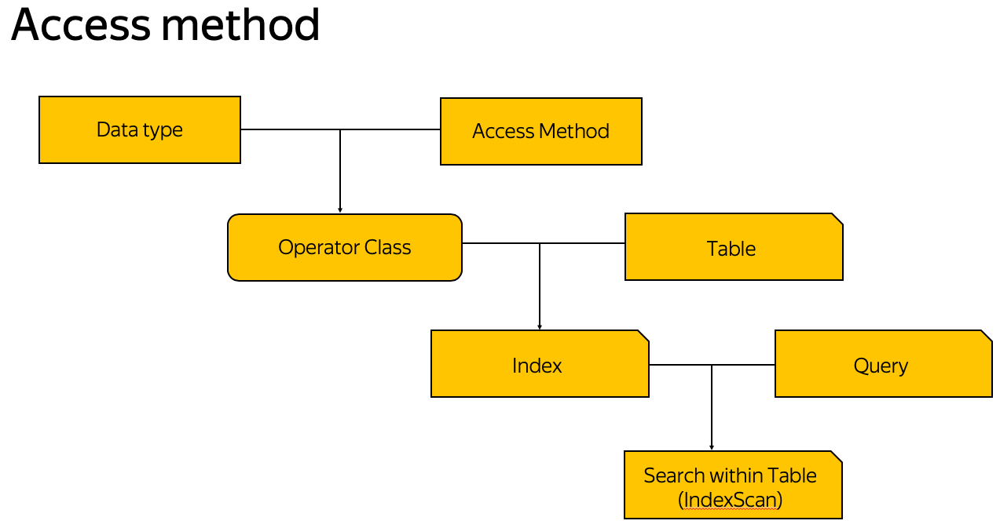

# Index DIY
Supplementary materials for my PGCon 2020 talk "Index DIY".
Until May 27th this file is WIP. I'm still working on contents.

If you have a question and want a detailed answer - please create Issue in this repository. Of course, I will answer all questions from IRC and live QA Zoom session too.

For large files I used [Yandex.Disk shared folder](https://yadi.sk/d/z9ZbSmp8mM1YSA).
There you can find slides in pptx and pdf formats, some referenced papers and other stuff.

## About this talk
This talk is about forking Index Access Methods from PostgreSQL core.

```A database index is a data structure that improves the speed of data retrieval operations on a database table at the cost of additional writes and storage space to maintain the index data structure.```
[Wikipedia](https://en.wikipedia.org/wiki/Database_index)



Index Access Method is implementation of idea how to search.
PostgreSQL has a lot of core index access methods:
Method | Idea | Docs
--- | --- | ---
B-tree | Search among sorted objects | [docs](https://www.postgresql.org/docs/current/btree.html)
GiST \ SP-GiST | Descending from group with generic features to specific | [docs](https://www.postgresql.org/docs/current/gist.html)
GIN | Searching object by its part | [docs](https://www.postgresql.org/docs/current/gin-intro.html)
Hash | Reducing search region to objects with same hash | [docs](https://www.postgresql.org/docs/current/indexes-types.html)
BRIN | Digesting groups of data to skip them during sequential search | [docs](https://www.postgresql.org/docs/current/brin-intro.html)
Bloom | Digesting all data to skip search for non-existent values | [docs](https://www.postgresql.org/docs/current/bloom.html)

High modularity of many Index Access Methods like GiST allows to fork them into extension.

Official documentation is the source of truth. Docs for pluggable index access methods can be found here https://www.postgresql.org/docs/current/indexam.html

Thread about cache prefetches https://www.postgresql.org/message-id/flat/3B774C9E-01E8-46A7-9642-7830DC1108F1%40yandex-team.ru
